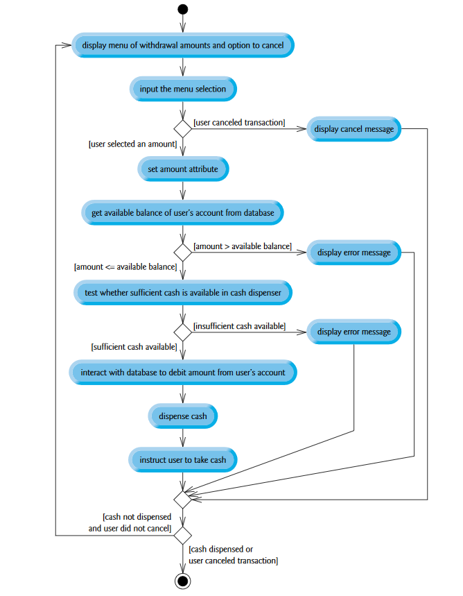
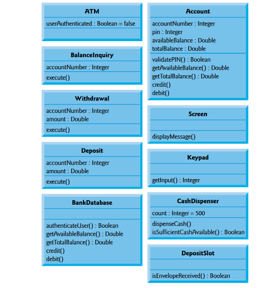

Run the program
```python main.py```


More about the program:

Ideally we would want to go for something like the below. 
My program is written is python and does not adhere to all OOP and SOLID principles but the below is what I would go for if I did have more time. 




